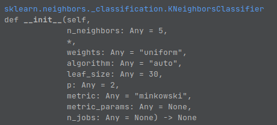

# K NEAREST NEIGHBORS

check out this 
https://archive.ics.uci.edu/ml/datasets/Car+Evaluation  

best to create a virtualEnv (I am using Conda)  
python=3.10 || >3.7  
pandas  
keras  
numpy  
sklearn  
matplotlib  
pickle --> to save models

Virtual ENV
Install anaconda
create virtual env
### `conda create ENV_NAME`
In your 'cd' and goto file directory of where you want to code
### `conda activate ENV_NAME`
Install the above listed packages using pip
### `pip install package_name`

To deactivate environment
### `conda deactivate`
