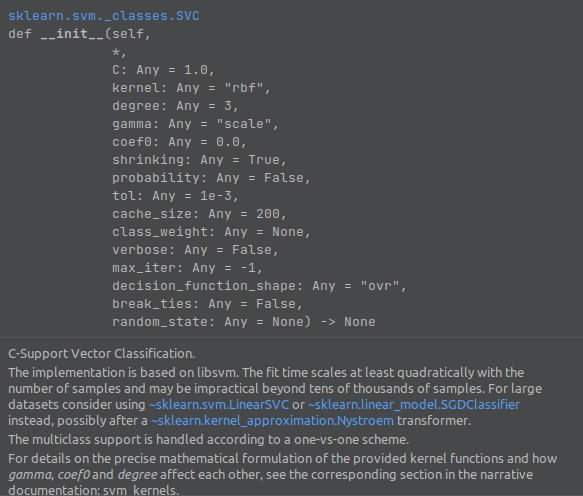

# SUPPPORT VECTOR MACHINE
check out this 
https://scikit-learn.org/stable/modules/generated/sklearn.svm.SVC.html

best to create a virtualEnv (I am using Conda)  
python=3.10 || >3.7    
sklearn  
pickle --> to save models

Virtual ENV
Install anaconda
create virtual env
### `conda create --name ENV_NAME`
In your 'cd' and goto file directory of where you want to code
### `conda activate ENV_NAME`
Install the above listed packages using pip
### `pip install package_name`

To deactivate environment
### `conda deactivate`
